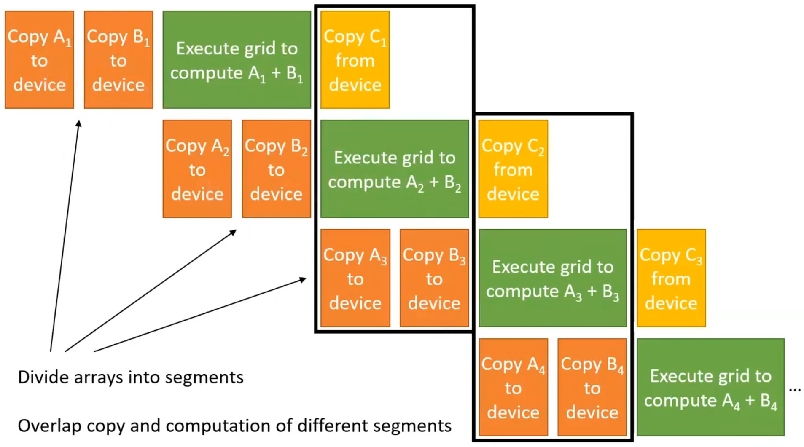

Day 20: Pinned Memory and Streams

1) Resources:

The lecture 21 of GPU Computing by Dr. Izzat El Hajj  
Lecture 21: https://youtu.be/aNchuoFCgSs?si=rnV6lqbgNUW2X0Na

2) Topics Covered:

- Pinned Memory
- Streams

3) Summary of the Lecture:  

- Direct Memory Access (DMA) allows some hardware to access memory without involving the CPU
- Copying between CPU and GPU uses DMA. Advantage: CPU can be utilized for other things while the memory copy is taking place

- Pinned memory:
    - DMA uses physical addresses to access memory: cannot detect if the OS swaps a virtual page with another virtual page at the same physical address
    - To avoid data corruption, the OS must not be allowed to swap pages being accessed by DMA
    - Pages to be accessed by DMA must be allocated as pinned (or page-locked) memory: i.e., pages are marked so OS does not swap them out

- cudaMemcpy:
    - cudaMemcpy works as follows:
        - Host to device:
            - CPU copies data to a pinned memory buffer
            - DMA copies data from the pinned memory buffer to the device
        - Device to host:
            - DMA copies data from the device to a pinned memory buffer
            - CPU copies data from the pinned memory buffer to the host
    
    - Disadvantage: every cudaMemcpy us actually two copies, which incurs overhead

- Copies can be made faster by allocating host arrays directly in pinned memory
- API call to (de)allocate host data in pinned memory:
    cudaError_t cudaMallocHost(void **devPtr, size_t size)
    - devPtr: pointer to pointer to allocated device memory
    - size: Requested allocation size in bytes
    cudaError_t cudaFreeHost(void *devPtr)
    - devPtr: Pointer to device memory to free
- Use with caution!
    - Only use for frequently copied data if overhead is high
    - Allocating too much pinned memory degrades overall system performance by reducing the virtual pages for swapping

- Parallelism in System Architecture:
    - Typical system is simultaneously capable of:
        - Executign grids on the GPU
        - Copying from host to device
        - Copying from device to host

- Vector addition system utilization:
    Copy A to device -> Copy B to device -> Execute kernel -> Copy C from device  

    - Not utilizing GPU and copy from device to host for: copy A to device & copy B to device
    - Not utilizing copy from host to device and from device to host for: execute kernel
    - Not utilizing GPU and copy from host to device for: copy C from device

- Pipeline Vector Addition:

- Streams and Asynchronous Copies:
    - Parallelism between grids and memory copies can be achieved using streams
        - Tasks in different srteams are executed in parallel
        - Tasks in the same stream are serialized
        - If no stream is specified, tasks go into the default stream
    - To overlap memory copies with host execution, asynchronous memory copies are used:
        - Allows host to proceed without watiing for copy to finish so that it can enqueue tasks in other streams
    - To create a stream:
        cudaError_t cudaStreamCreate(cudaStream_t* pStream)
        - pStream: Pointer to new stream identifier
    - To create an asynchronous copy in a stream:
        cudaError_t cudaMemcpyAsync(void* dst, const void* src, size_t count, cudaMemcpyKind kind, cudaStream_t stream=0)
        - Similar to cudaMemcpy, with additional parameter to specify the stream
    - To launch a grid in a specific stream:
        kernel <<< grid, block, smem, stream >>> (...)
        - Fourth configuration in the kernel call

4) Implementation:

The code performs graph processing on the GPU

Compiling the code:  

<pre>nvcc .\graph.cu -o graph</pre>

Running the code after compiling: 
<pre> graph </pre>

<pre>Top-Down BFS Timings (ms): Copy H->D: 0.480064, Kernel: 0.977760, Copy D->H: 0.001632, Total: 1.493472
Bottom-Up BFS Timings (ms): Copy H->D: 0.332288, Kernel: 0.400640, Copy D->H: 0.001696, Total: 0.776704
Direction-Optimized BFS Timings (ms): Copy H->D: 0.322912, Kernel: 0.187040, Copy D->H: 0.001824, Total: 0.527072
Edge-Centric BFS Timings (ms): Copy H->D: 0.253728, Kernel: 0.240256, Copy D->H: 0.001728, Total: 0.537536</pre>
