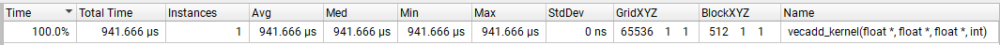

Day 8: Stencil

1) Resources:

The lecture 9 of GPU Computing by Dr. Izzat El Hajj  
Lecture 9: https://youtu.be/NOoSyDCVRU0?si=r6osYI4Z8Ga0gpOs

2) Topics Covered:

- Parallel pattern: stencil computation

3) Summary of the Lecture:  

- The stencil computation pattern refers to a class of computations on a structured grid where a value at a grid point is computed based on a subset of the point's neighbors.

4) Implementation:

The code performs profiling for vector addition and matrix multiplication on the GPU.  

Note: nvprof was deprecated in CUDA 10.2 and removed from the CUDA Toolkit starting with version 11.0. If you have CUDA 11.x or 12.x installed, you will not have nvprof available by default. Instead, you must use NVIDIA Nsight Systems or NVIDIA Nsight Compute for profiling CUDA applications. Install the latest NVIDIA Nsight Systems and NVIDIA Nsight Compute from NVIDIA's official website. Once you have installed the programs, you need to add below (please update based on your system paths) to path in environment variables.

"C:\Program Files\NVIDIA Corporation\Nsight Compute 2025.1.1"
"C:\Program Files\NVIDIA Corporation\Nsight Systems 2025.1.1\target-windows-x64"

After adding the paths, restart the terminal and make sure it works:

nsys --version

The code was executed on the NVIDIA GeForce RTX 3080Ti Laptop GPU - 16 GB. The output of the code is as follows:

1) Compiling the code for vector addition:  

<pre>nvcc vector_addition.cu -o vecadd</pre>

Running the code after compiling: 
<pre>vecadd</pre>

Start running NSYS after running CUDA code: 
<pre>nsys profile --stats=true -o vecadd-profile ./vecadd</pre>

<pre>WARNING: CPU context switches trace requires administrative privileges, disabling.
WARNING: CPU sampling requires administrative privileges, disabling.
WARNING: Device-side CUDA Event completion trace is currently enabled.
         This may increase runtime overhead and the likelihood of false
         dependencies across CUDA Streams. If you wish to avoid this, please
         disable the feature with --cuda-event-trace=false.
Collecting data...
Generating 'C:\Users\kerem.delikoyun\AppData\Local\Temp\nsys-report-ca23.qdstrm'
[1/8] [========================100%] vecadd-profile.nsys-rep
[2/8] [========================100%] vecadd-profile.sqlite
[3/8] Executing 'nvtx_sum' stats report
SKIPPED: D:\cuda\120_days_of_CUDA_challenge\daily_projects\day_8\vecadd-profile.sqlite does not contain NV Tools Extension (NVTX) data.
[4/8] Executing 'osrt_sum' stats report
SKIPPED: No data available.
[5/8] Executing 'cuda_api_sum' stats report

 Time (%)  Total Time (ns)  Num Calls   Avg (ns)    Med (ns)   Min (ns)  Max (ns)  StdDev (ns)           Name
 --------  ---------------  ---------  ----------  ----------  --------  --------  -----------  ----------------------
     56.0         66728597          2  33364298.5  33364298.5    953384  65775213   45835954.9  cudaDeviceSynchronize
     40.2         47883078          3  15961026.0  11116170.0  11036298  25730610    8460802.2  cudaMemcpy
      2.1          2556951          3    852317.0    770129.0    605343   1181479     296731.1  cudaFree
      0.8           999878          1    999878.0    999878.0    999878    999878          0.0  cudaLaunchKernel      
      0.7           821880          3    273960.0    241480.0    196623    383777      97713.2  cudaMalloc
      0.1            77908          4     19477.0     11584.0      7150     47590      19168.2  cudaEventRecord
      0.0            26433          1     26433.0     26433.0     26433     26433          0.0  cuLibraryUnload
      0.0            22084          4      5521.0      4539.0       566     12440       4989.6  cudaEventCreate
      0.0            16952          2      8476.0      8476.0      7099      9853       1947.4  cudaEventSynchronize
      0.0             8580          4      2145.0      1620.5       432      4907       2031.8  cudaEventDestroy
      0.0             4140          1      4140.0      4140.0      4140      4140          0.0  cuModuleGetLoadingMode
      0.0             2615          1      2615.0      2615.0      2615      2615          0.0  cuCtxSynchronize
      0.0              294          1       294.0       294.0       294       294          0.0  cuDeviceGetLuid

[6/8] Executing 'cuda_gpu_kern_sum' stats report

 Time (%)  Total Time (ns)  Instances  Avg (ns)  Med (ns)  Min (ns)  Max (ns)  StdDev (ns)                      Name
 --------  ---------------  ---------  --------  --------  --------  --------  -----------  ---------------------------------------------
    100.0           941666          1  941666.0  941666.0    941666    941666          0.0  vecadd_kernel(float *, float *, float *, int)

[7/8] Executing 'cuda_gpu_mem_time_sum' stats report

 Time (%)  Total Time (ns)  Count   Avg (ns)    Med (ns)   Min (ns)  Max (ns)  StdDev (ns)           Operation
 --------  ---------------  -----  ----------  ----------  --------  --------  -----------  ----------------------------
     67.2         22533802      2  11266901.0  11266901.0  10961844  11571958     431415.7  [CUDA memcpy Host-to-Device]
     32.8         11008916      1  11008916.0  11008916.0  11008916  11008916          0.0  [CUDA memcpy Device-to-Host]

[8/8] Executing 'cuda_gpu_mem_size_sum' stats report

 Total (MB)  Count  Avg (MB)  Med (MB)  Min (MB)  Max (MB)  StdDev (MB)           Operation
 ----------  -----  --------  --------  --------  --------  -----------  ----------------------------
    268.435      2   134.218   134.218   134.218   134.218        0.000  [CUDA memcpy Host-to-Device]
    134.218      1   134.218   134.218   134.218   134.218        0.000  [CUDA memcpy Device-to-Host]

Generated:
        D:\cuda\120_days_of_CUDA_challenge\daily_projects\day_8\vecadd-profile.nsys-rep
        D:\cuda\120_days_of_CUDA_challenge\daily_projects\day_8\vecadd-profile.sqlite</pre>

2) Compiling the code for matrix multiplication:  

<pre>nvcc matmul_equaldim.cu -o matmul</pre>

Running the code after compiling: 
<pre>matmul</pre>

Start running NSYS after running CUDA code: 
<pre>nsys profile --stats=true -o matmul-profile ./matmul</pre>

<pre>WARNING: CPU context switches trace requires administrative privileges, disabling.
WARNING: CPU sampling requires administrative privileges, disabling.
WARNING: Device-side CUDA Event completion trace is currently enabled.
         This may increase runtime overhead and the likelihood of false
         dependencies across CUDA Streams. If you wish to avoid this, please
         disable the feature with --cuda-event-trace=false.
Collecting data...
Generating 'C:\Users\kerem.delikoyun\AppData\Local\Temp\nsys-report-dc1a.qdstrm'
[1/8] [========================100%] matmul-profile.nsys-rep
[2/8] [========================100%] matmul-profile.sqlite
[3/8] Executing 'nvtx_sum' stats report
SKIPPED: D:\cuda\120_days_of_CUDA_challenge\daily_projects\day_8\matmul-profile.sqlite does not contain NV Tools Extension (NVTX) data.
[4/8] Executing 'osrt_sum' stats report
SKIPPED: No data available.
[5/8] Executing 'cuda_api_sum' stats report

 Time (%)  Total Time (ns)  Num Calls  Avg (ns)   Med (ns)  Min (ns)  Max (ns)  StdDev (ns)           Name
 --------  ---------------  ---------  ---------  --------  --------  --------  -----------  ----------------------
     89.6         60815816          8  7601977.0     413.0       289  60807650   21498338.5  cudaEventCreate
      4.5          3036396          5   607279.2    6072.0      1938   2932288    1300290.5  cudaDeviceSynchronize
      2.5          1663889          3   554629.7  428649.0    371769    863471     268972.2  cudaMemcpy
      1.4           923384          1   923384.0  923384.0    923384    923384          0.0  cudaLaunchKernel      
      0.7           477926          4   119481.5    8132.0      5231    456431     224637.2  cudaEventSynchronize
      0.7           470374          3   156791.3  135708.0     93338    241328      76214.4  cudaFree
      0.5           361929          3   120643.0   77917.0     77104    206908      74708.8  cudaMalloc
      0.1            82136          8    10267.0   10498.0      3378     20078       6014.7  cudaEventRecord
      0.0            23453          1    23453.0   23453.0     23453     23453          0.0  cuLibraryUnload
      0.0             4869          8      608.6     360.5       302      2071        600.3  cudaEventDestroy      
      0.0             4315          1     4315.0    4315.0      4315      4315          0.0  cuModuleGetLoadingMode
      0.0             4104          1     4104.0    4104.0      4104      4104          0.0  cuCtxSynchronize
      0.0              306          1      306.0     306.0       306       306          0.0  cuDeviceGetLuid

[6/8] Executing 'cuda_gpu_kern_sum' stats report

 Time (%)  Total Time (ns)  Instances  Avg (ns)   Med (ns)   Min (ns)  Max (ns)  StdDev (ns)                           Name
 --------  ---------------  ---------  ---------  ---------  --------  --------  -----------  ------------------------------------------------------
    100.0          2918629          1  2918629.0  2918629.0   2918629   2918629          0.0  matmul_kernel(float *, float *, float *, unsigned int)

[7/8] Executing 'cuda_gpu_mem_time_sum' stats report

 Time (%)  Total Time (ns)  Count  Avg (ns)  Med (ns)  Min (ns)  Max (ns)  StdDev (ns)           Operation
 --------  ---------------  -----  --------  --------  --------  --------  -----------  ----------------------------
     54.1           695041      2  347520.5  347520.5    344129    350912       4796.3  [CUDA memcpy Host-to-Device]
     45.9           590113      1  590113.0  590113.0    590113    590113          0.0  [CUDA memcpy Device-to-Host]

[8/8] Executing 'cuda_gpu_mem_size_sum' stats report

 Total (MB)  Count  Avg (MB)  Med (MB)  Min (MB)  Max (MB)  StdDev (MB)           Operation
 ----------  -----  --------  --------  --------  --------  -----------  ----------------------------
      8.389      2     4.194     4.194     4.194     4.194        0.000  [CUDA memcpy Host-to-Device]
      4.194      1     4.194     4.194     4.194     4.194        0.000  [CUDA memcpy Device-to-Host]

Generated:
        D:\cuda\120_days_of_CUDA_challenge\daily_projects\day_8\matmul-profile.nsys-rep
        D:\cuda\120_days_of_CUDA_challenge\daily_projects\day_8\matmul-profile.sqlite</pre>

After generating profile files for both vector addition and matrix multiplication, run Nsights Systems 2025.1.1 from Windows Start Menu and open the generated file to see the profiling results:

1) Vector Addition Profiling:  

- Kernel info:  

- Memory info:  

2) Matrix Multiplication Profiling:  

- Kernel info:  

- Memory info:  

